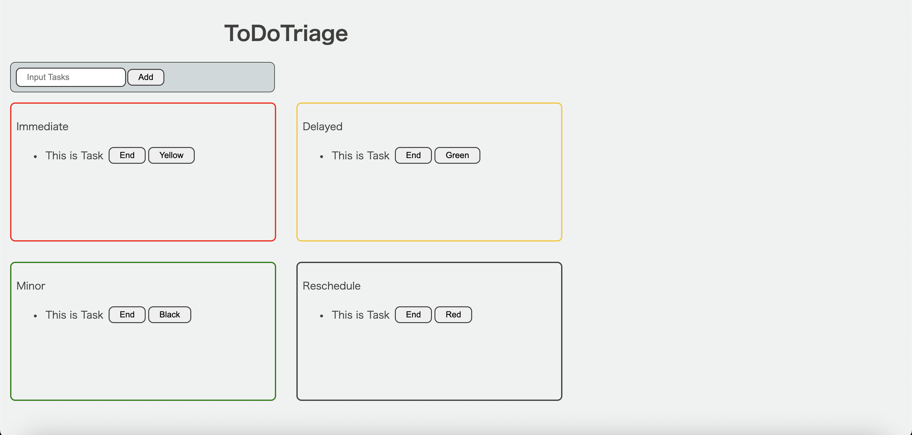

# タスクのトリアージアプリ
## 本アプリでの対応範囲
- 要件定義
- 設計書作成
- モック作成
- DB構築
- バックエンド実装
- **`フロントエンド実装:React`**
- **`コンテナ構築:Docker, Ubuntu`**
- 単体テスト
- 結合テスト
- **`クラウドサービス(本番環境)にデプロイ:GitHub Pages`**
- システムテスト
## 概要

Dockerのコンテナ上にUbuntuを構築し、その上にViteでReactの環境を構築しました。

それをベースに、ToDoアプリの拡張版としてトリアージアプリの実装をしました。

具体的にはタスクを4つの優先度(高いものから赤、黄、緑、黒)に分け、タスク追加したところから順を追って優先度を下げられるようにしています。

## 今後の課題
- React単体でのアプリとなっているのでRESTAPIなどとも連携できるようにすること
- 画面をリセットすると消えてしまうのでDBを用いてそれぞれの項目を保持すること
- タスクの個数制限などの機能強化